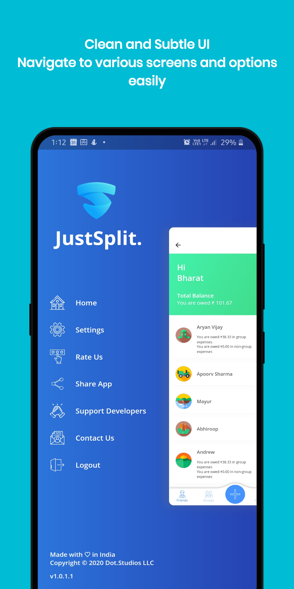

    

 

# 
JustSplit

#### 
A product of <a href="https://dotstudios.ml">Dot.Studios LLC</a>
 

    
    
    
    

  

Did you pay for your friends and feel anxious about asking money back? Dont you worry! Just Split all expenses with friends, family or anybody and bring peace to your mind. JustSplit's mission is to reduce the stress and awkwardness that money places on our most important relationships. Go ahead, download the app now!!

 

## Get It On

 

## Screenshots

 

    
    
    
    
    
    

 

## Bugs or Reports

If you encounter any problems feel free to open an [issue](https://github.com/bharat-1809/JustSplit/issues/new?assignees=&labels=&template=bug_report.md&title=). If you feel the app is missing a feature, please raise a [ticket](https://github.com/bharat-1809/JustSplit/issues/new?assignees=&labels=&template=feature_request.md&title=) on GitHub and I'll look into it. Pull requests are also welcome.

See [Contributing Guidelines](CONTRIBUTING.md).

 

## Contributing

Contributions of any kind are welcome! See [Contributing Guidelines](CONTRIBUTING.md) and [Code of Conduct](CODE_OF_CONDUCT.md).

### Overview

- App tries to follow Clean Architecture guidelines. Logic is separated from the UI. 
- App uses [BLoC](https://bloclibrary.dev/#/coreconcepts) extensively
- If you find something in code that looks a bit odd, it might be some useful extension method from `lib/extensions`

 

## Donate

> If you found this project helpful or you learned something from the source code and want to thank me, consider buying me a cup of ☕
> - [PayPal](https://paypal.me/bsharma1809)

 

## License

JustSplit is licensed under `Apache 2.0 License`. View [License](LICENSE.md)

